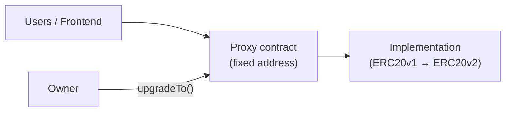

# Upgradeable ERC20 Token

A full-stack demo of an **upgradeable ERC-20 token** using OpenZeppelin’s UUPS proxy pattern, deployed with **Hardhat**, and interacted with through a **React** frontend and **MetaMask**.

| Layer | Stack |
|-------|--------|
| Contracts | Solidity 0.8.30, OpenZeppelin Upgradeable, UUPS |
| Tooling | Hardhat, `@openzeppelin/hardhat-upgrades` |
| Frontend | React 18, ethers.js v6 |
| Network (deploy) | Sepolia testnet (configurable) |

---

## Project structure

```
├── src/                    # Solidity contracts
│   ├── ERC20v1.sol         # Initial implementation (mint, Ownable, UUPS)
│   └── ERC20v2.sol         # Upgrade adds burn()
├── scripts/
│   └── deployAndUpgrade.js # Deploy V1 proxy + upgrade to V2
├── test/                   # Hardhat tests (add tests here)
├── frontend/               # React dApp
│   └── src/App.js          # Wallet UI; proxy address configured here
├── hardhat.config.js
├── .openzeppelin/          # OZ upgrades manifest (per network)
└── .env                    # Secrets (not committed; see below)
```

---

## Prerequisites

- **Node.js** 18+ and **npm**
- **MetaMask** (or another EIP-1193 wallet) for the frontend
- For Sepolia deployment:
  - Sepolia ETH on the deployer account ([faucet](https://sepoliafaucet.com/))
  - An RPC URL (e.g. [Alchemy](https://www.alchemy.com/), [Infura](https://www.infura.io/), or a public endpoint)

---

## Project setup

### 1. Clone and install contract dependencies

From the repository root:

```bash
npm install
```

### 2. Environment variables

Create a `.env` file in the project root (this file is gitignored):

```env
# Deployer wallet (must have Sepolia ETH for testnet deploy)
PRIVATE_KEY=0xYOUR_PRIVATE_KEY_WITHOUT_QUOTES

# JSON-RPC endpoint for Sepolia
SEPOLIA_RPC_URL=https://your-sepolia-rpc-url
```

Never commit real private keys. Use a dedicated test wallet with minimal funds.

### 3. Compile contracts

```bash
npm run compile
```

### 4. Install and run the frontend

```bash
cd frontend
npm install
npm start
```

The app opens at [http://localhost:3000](http://localhost:3000).

### 5. Point the frontend at your proxy

After deployment, copy the **proxy address** from the script output and set it in `frontend/src/App.js`:

```javascript
const CONTRACT_ADDRESS = "0xYourProxyAddress";
```

The proxy address is the permanent address users and the UI should use; it does not change when you upgrade the implementation.

### 6. Configure MetaMask

- Add the **Sepolia** network (chain ID `11155111`) if it is not already present.
- Import or connect the account you use for testing.
- Ensure that account holds Sepolia ETH for gas.

---

## Running locally (Hardhat in-memory network)

Useful for quick iteration without spending testnet ETH:

```bash
# Terminal 1 — deploy + upgrade on Hardhat’s default network
npm run deploy

# Terminal 2 — frontend (still needs MetaMask; use a local chain or Sepolia)
cd frontend && npm start
```

For a full local chain with MetaMask, run `npx hardhat node` in one terminal and deploy with:

```bash
npx hardhat run scripts/deployAndUpgrade.js --network localhost
```

Add that network in MetaMask (typically `http://127.0.0.1:8545`, chain ID `31337`) and import a Hardhat test account private key from the node output.

---

## Deployment steps

### Deploy contracts to Sepolia

From the repository root, with `.env` configured:

```bash
npm run deploy-sepolia
```

Equivalent:

```bash
npx hardhat run scripts/deployAndUpgrade.js --network sepolia
```

### What the deploy script does

`scripts/deployAndUpgrade.js` runs two steps in one execution:

1. **Deploy V1 (UUPS proxy)**  
   - Deploys `ERC20v1` as an implementation behind a UUPS proxy.  
   - Calls `initialize(deployer)` — token name **MyToken**, symbol **MTK**, **1,000,000** tokens minted to the deployer.  
   - Prints the **proxy address** (keep this for the frontend).

2. **Upgrade to V2**  
   - Calls `upgrades.upgradeProxy` to point the same proxy at `ERC20v2`.  
   - Prints the new **implementation** address (proxy address unchanged).

Example output:

```
Deploying to network: sepolia
Chain ID: 11155111
V1 Proxy deployed to: 0x...
implimentation address: 0x...
Upgrading logic contract...
Successfully upgraded
New implementation (V2) deployed to: 0x...
```

### Verify on a block explorer

On [Sepolia Etherscan](https://sepolia.etherscan.io/):

- Look up the **proxy** address for user-facing token interactions.
- The **implementation** address is the logic contract (changes after each upgrade).

Optional (if you add an Etherscan API key to Hardhat):

```bash
npx hardhat verify --network sepolia <IMPLEMENTATION_ADDRESS>
```

### Deploy frontend (production build)

```bash
cd frontend
npm run build
```

Serve the `frontend/build` folder with any static host (Vercel, Netlify, S3 + CloudFront, nginx, etc.). There is no backend server; the app talks to the chain only through the user’s wallet.

Before building for production:

1. Set `CONTRACT_ADDRESS` in `App.js` to your deployed proxy.
2. Rebuild so the address is baked into the bundle.

---

## Upgrade process (brief)

This project uses the **UUPS** (Universal Upgradeable Proxy Standard) pattern:



| Concept | Role |
|--------|------|
| **Proxy** | Stores balances, ownership, and ERC-20 state; address never changes. |
| **Implementation** | Logic (`ERC20v1`, then `ERC20v2`); replaced on upgrade. |
| **`_authorizeUpgrade`** | Only the **owner** can upgrade (in `ERC20v1`). |

**V1 → V2 change:** `ERC20v2` inherits `ERC20v1` and adds `burn(uint256)`, which burns tokens from `msg.sender`. No new storage variables were added, so the storage layout stays compatible.

**How upgrade is performed in this repo:**

```javascript
const upgraded = await upgrades.upgradeProxy(proxyAddress, ERC20v2, { kind: "uups" });
```

OpenZeppelin’s plugin validates storage layout and updates `.openzeppelin/<network>.json` for future upgrades.

**Upgrading an already-deployed proxy (without redeploying):**

1. Change or extend logic in a new contract (e.g. `ERC20v3`) while preserving storage layout rules.
2. Run a script that only calls `upgrades.upgradeProxy(existingProxy, NewFactory, { kind: "uups" })`.
3. Do **not** run the full `deployAndUpgrade.js` on production if you only intend to upgrade — that script deploys a **new** proxy each time.

**Frontend after upgrade:** No change required if you keep using the same proxy address; new ABI functions (e.g. `burn`) appear once the implementation is V2.

---

## Frontend usage

| Action | Who | Notes |
|--------|-----|--------|
| Connect wallet | Any user | MetaMask on Sepolia (or matching chain) |
| View balance / token info | Any user | Reads proxy via ethers |
| Mint | **Owner only** | Recipient + amount |
| Burn | Any holder | V2 feature; burns own balance |

1. Open the app and click **Connect MetaMask**.
2. Confirm the network shows **Sepolia** (chain ID `11155111`).
3. **Owner:** use **Mint Tokens** to send MTK to an address.
4. **Any user with balance:** use **Burn Tokens** to destroy their own tokens.

---

## Scripts reference

| Command | Description |
|---------|-------------|
| `npm run compile` | Compile Solidity |
| `npm run test` | Run Hardhat tests |
| `npm run deploy` | Deploy + upgrade on default Hardhat network |
| `npm run deploy-sepolia` | Deploy + upgrade on Sepolia |
| `cd frontend && npm start` | Dev server |
| `cd frontend && npm run build` | Production static build |

---

## Assumptions and design decisions

1. **UUPS over transparent proxy** — Upgrades are authorized in the implementation (`_authorizeUpgrade`), keeping the proxy simpler and gas cheaper for users.

2. **Inheritance for V2** — `ERC20v2 is ERC20v1` avoids duplicating logic and keeps storage layout stable; required for safe upgrades.

3. **Single deploy script** — `deployAndUpgrade.js` deploys V1 and immediately upgrades to V2 for demo purposes. Production usually splits “initial deploy” and “upgrade” scripts.

4. **Owner-centric control** — Deployer becomes owner via `initialize`; only owner can `mint` and authorize upgrades.

5. **Fixed initial supply** — 1 million MTK (18 decimals) minted to the owner at initialization; no public mint.

6. **Hardcoded contract address in frontend** — `CONTRACT_ADDRESS` lives in `App.js` rather than `REACT_APP_*` env vars, to keep the demo simple. For multiple environments, move the address to `REACT_APP_CONTRACT_ADDRESS` and rebuild per environment.

7. **Sepolia as target network** — `hardhat.config.js` defines `sepolia` only; extend `networks` for mainnet or other chains as needed.

8. **OpenZeppelin upgrades manifest** — `.openzeppelin/sepolia.json` records proxy and implementation addresses; commit this if you want reproducible upgrades across machines (no secrets inside).

9. **Optimizer enabled** — `runs: 200` in Hardhat for smaller deployment bytecode.

10. **No separate backend** — All writes go through the user’s wallet; no relayer or indexer is included.

---

## Security notes

- Use a **test-only** private key in `.env`.
- Only the **owner** can upgrade the contract; protect that key accordingly.
- Review [OpenZeppelin upgrade safety](https://docs.openzeppelin.com/upgrades-plugins/writing-upgradeable-contracts) before adding storage variables or changing inheritance order.
- Re-running `deployAndUpgrade.js` on Sepolia creates **new** proxies; it does not upgrade an existing deployment unless you change the script to use a known proxy address.

---

## Troubleshooting

| Issue | Likely cause | Fix |
|-------|----------------|-----|
| `Failed to load contract data` | Wrong network or wrong `CONTRACT_ADDRESS` | Switch MetaMask to Sepolia; update proxy in `App.js` |
| Deploy fails on Sepolia | Missing ETH or bad RPC / key | Fund deployer; check `.env` |
| Mint fails | Caller is not owner | Connect with the deployer/owner account |
| Burn missing / fails | Still on V1 implementation | Run upgrade or redeploy with full script |
| `Insufficient funds` | Low Sepolia ETH | Use a faucet |

---

## License

ISC (see `package.json`).
